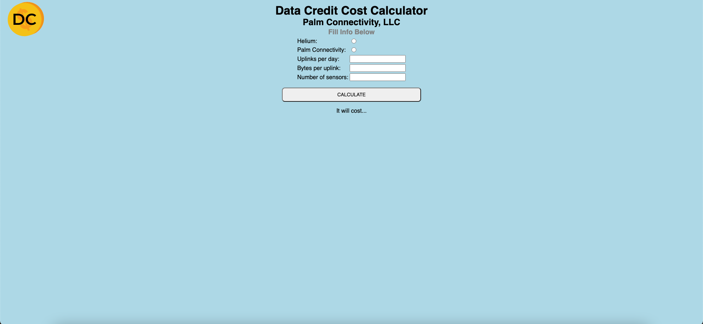

## Data Credit Calculator
*Helium Network and Palm Connectivity Network Data Credit Calculator*

Finding a way to calculate the USD amount spent on data credits per month on the Helium network was a bit of a challange so I decided to write a simple browser app to determine this for me. I am new to coding and would love some ideas on features I could impliment to this web app. 

### How to use:
1. Select the network you plan on using
	*You can ignore the Palm Connectivity network, this is for my companies internal use and calculates our cost to run our AWS server*
2. Enter the Uplinks you want to send per day
	*48 uplinks is 2 times per hour*
3. Enter the size of the Byte you are sending over the network.
	*This can be viewed by looking at your specific sensors packet decoder information*

### Software GUI Example
This is an example of how you would interface with the software on a web browser.

